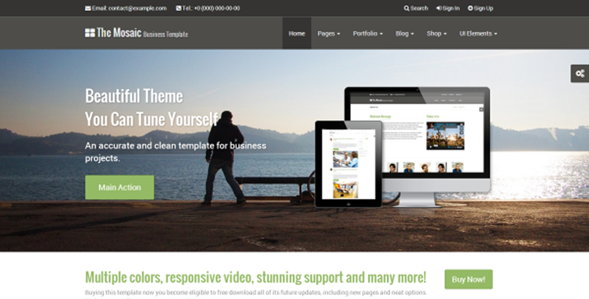

# theme_bootstrap_mosaic
TYPO3 compatible adaptation of the "Mosaic - Responsive Professional Theme" by simpleqode



# Features

* Isotope Effekt for EXT:news via sys_categories
* Drop Down Menus
* fullscreen width carousel
* Blog Layout with EXT:news

# License
Extended Wrap Bootstrap license for this theme has been bought by Cybercraft Media Manufactory, Clausthal-Zellerfeld, Germany.
The extension is redistributed under MIT license and can be freely used and modified according to the terms defined in the LICENSE file.

# Detailed feature description

## header dark and white rendering

The header can be rendered in two ways, either in black or in white.
The setting ```themes.configuration.menu.special.cssClasses``` can be set to one of these 2 values.


| value               | rendering result    |
|---------------------|---------------------|
| navbar navbar-dark  | dark navbar on top  |
| navbar navbar-white | white navbar on top |


## color worlds

The theme is shipped with five color worlds.

* Default (created from the Bootstrap settings)
* Green
* Blue
* Orange
* Red

These colors can be selected in the Frontend-Layout field of each page.
The color world is inherited from the parent pages, until you set it explizitly on a page.

## isotope effect

The extension is able to render news items as isotope. To create an isotope just add 2 news plugins:

| What to display  | Template  | Result                                 |
|------------------|-----------|----------------------------------------|
| Category Menu    | *Isotope* | Displays the Isotope category selector |
| List View        | *Isotope* | Displays the Isotop items              |

You can select the category to display in the category menu view.

## blog effect

The extension is able to render news items as blog entries. To create an blog just add 2 news plugins:

| What to display  | Template      | Result                             |
|------------------|---------------|------------------------------------|
| List View        | *Blog-List*   | Displays the Blog items            |
| Detailed View    | *Blog-Detail* | Displays a Blog item               |

You can select the category to display in the category menu view.


## Howto build a carousel like in demo site

1. Layout Page Appearence: ContentStartsite
2. Gridelements structure in section FEATURE

* Carousel
    * row bg_img
        * container
            * Column/Panel (Horizontal)
                 * Text (H1 Carousel Title fadeInDown)
                 * Images
    * row bg_img
        * container
            * Column/Panel (Vertical)
                * Text (H1 Carousel Title slideInLeft)
                * Images
    * row bg_img
        * container
            * Column/Panel (Horizontal)
                * Text (H1 Carousel Title slideInLeft)
                * Video
 No newline at end of file

